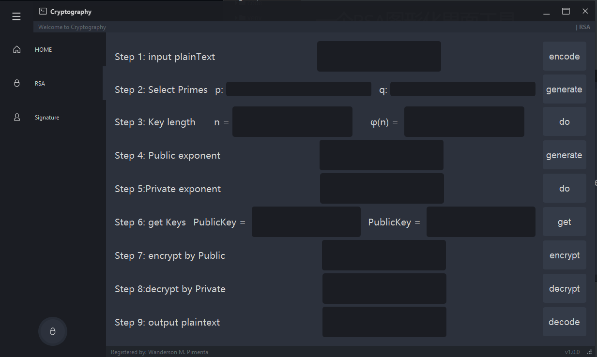

# A RSA GUI Tool

## GUI

### Home Page

### Simulate the RSA encryption and decryption process:

### Simulate the RSA signature and verification process:

##  **Announcement:**

> This GUI evolved from [Wanderson-Magalhaes/Simple_PySide_Base](https://github.com/Wanderson-Magalhaes/Simple_PySide_Base)
