# Demonstration

## Home Page

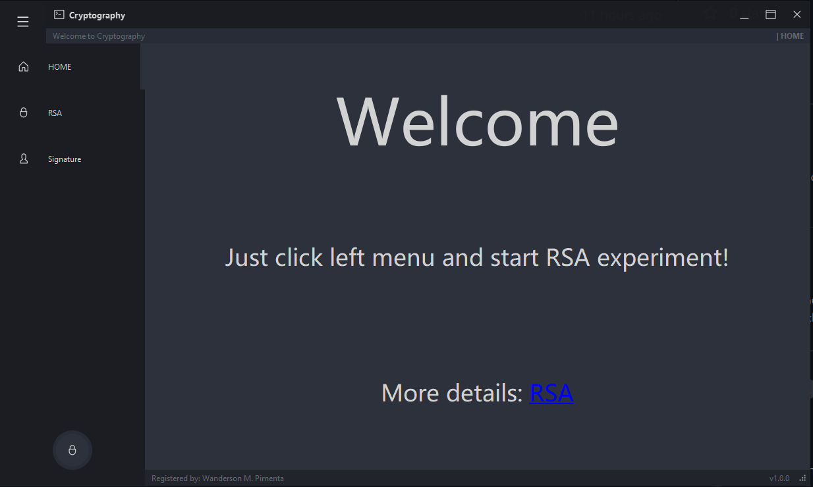

## Simulate the RSA encryption and decryption process:

### Step 1	 Input plainText

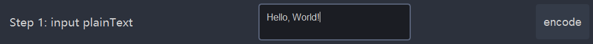

Then the program will encode it by UTF-8 as:

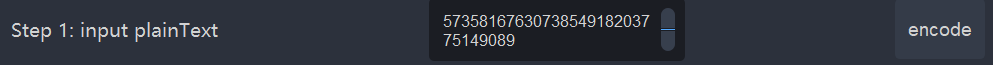

:x:**Error:** If you forget to input plainText:

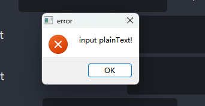

### Step 2	Generate primes

You have **two choice**:

1. Generate the two primes with **RSA-2048**:star:(recommened):

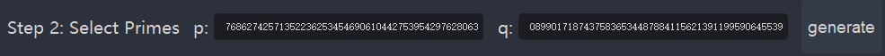

2. input the two primes **by hand:**

   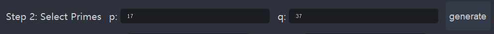

   :bangbang: If you choose this way, ensure that the two numbers are primes and $n = p \times q > length(encode(plainText))$, if not, you will get some errors like

   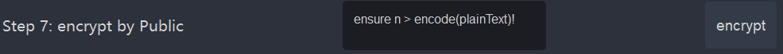

   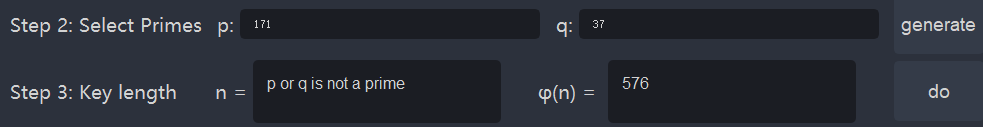

   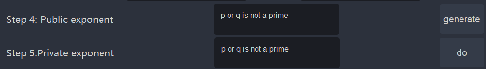

### Step 3	Key length

Compute the length of key $n$ and Euler funciton $\varphi(n)$ as: 

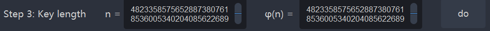

:bangbang: **Remember**：you must generate two primes $p$ and $q$ first, or the program will give you an error like this:

### Step 4,  5, 6	Public exponent $e$ and Private exponent $d$ and Keys

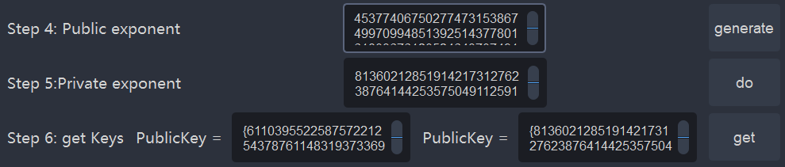

### Step 7	Encrypt 

Use publicKey to encrypt $encode(plainText)$ as: $C = M^e $ $mod$ $n$

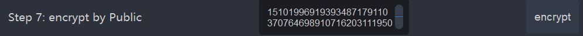

### Step 8	Decrypt

Use privateKey to decrypt  $C$  as: $M = C^d $ $mod$ $n$

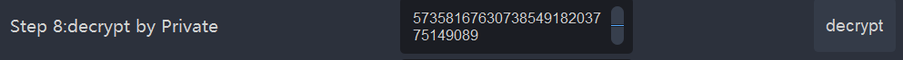

### Step 9	Decode plainText

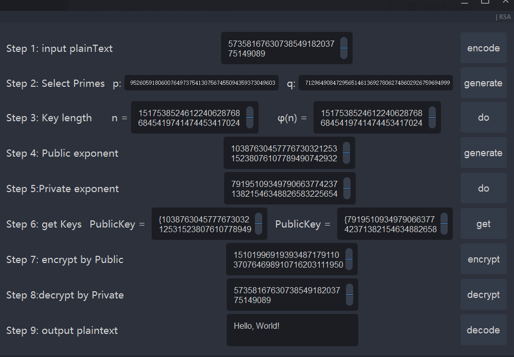

## Simulate the RSA signature and verification process:

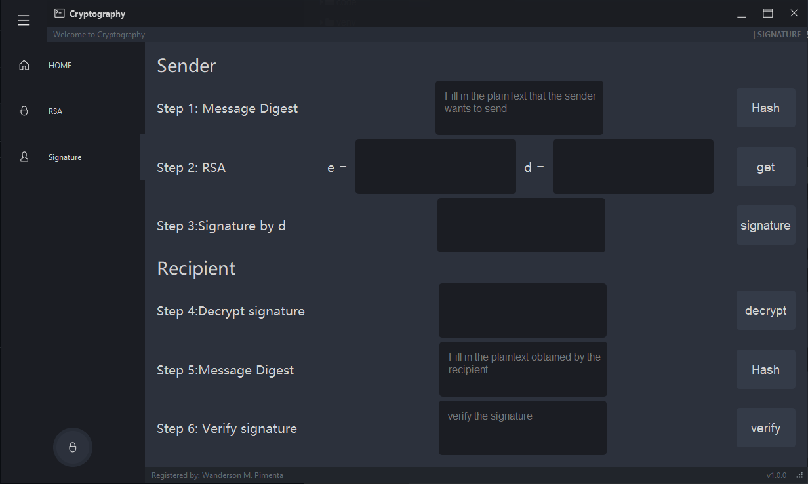

**A Completed Demo for RSA signature:**

First, the sender inputs "hello, world" in the plainText box, clicks the "hash" button, and generates a 128 bit information digest through the MD5 algorithm.

Next, the sender clicks the "get" button to generate the public key and private key through the RSA encryption algorithm. Then the sender clicks the "signature" button to encrypt the information summary. And he transmits the encrypted information to the receiver.

The receiver decrypts the received encrypted message digest to obtain the sender's message digest, then he can input the received plaintext "hello, world" in the plainText box, click the "hash" button, and generate a 128 bit message digest again.

After that, the sender clicks the "verify" button to compare it with the sender's information digest. If it is identical, the information is indeed sent by the sender and has not been tampered with.

## **Announcement:**

> This GUI evolved from [Wanderson-Magalhaes/Simple_PySide_Base](https://github.com/Wanderson-Magalhaes/Simple_PySide_Base)

## More details:

[RSA&Signature (shimo.im)](https://shimo.im/docs/rp3OVdRdRyF0abAm)

[RSA算法三部曲（一） – 生有涯知无涯 (infinityday.cn)](https://www.infinityday.cn/index.php/2022/11/28/rsa算法三部曲（一）/)

